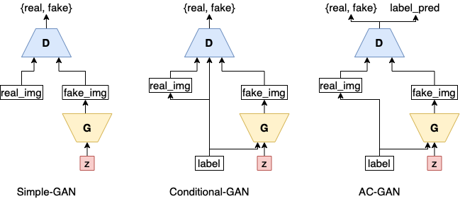

# AC-GAN
Tensorflow implementation of different Generative Adversarial Networks models

This repo consists of 3 implementations: original GAN, [Conditional GAN](https://arxiv.org/abs/1411.1784) and [AC-GAN](https://arxiv.org/abs/1610.09585).

### Usage

```
conda env create -f environment.yaml
conda activate gan_project
cd src/
python run.py --config ../config.yaml
```
config.yaml allows you to change model, as well as other hyperparameters.

### Models and Details 


GAN objective defines a two-player minimax game. If either side becomes obviously stronger than other, training fails. Thus, I carefully conducted experimentation on hyperparameters (especially on disc and gen learning rates).

Dataset is relatively simple MNIST, thus different architectures is not employed, but easily possible by changing model.py. Current generator has 1.3M, and discriminator has 390K parameters. Generating is harder than discriminating, hence this choice makes sense.

GAN training is further stabilized by using side information such as image labels. Conditional-GAN augments labels in both generator and discriminator, allowing the model to utilize extra information. This creates better image quality, and conditioned generation.

AC-GAN asks the discriminator predict class label, along with 'real or fake' prediction, which results in high dimensional quality image generation. For MNIST, I do not expect to sense any differences between Conditional-GAN and AC-GAN.

I implemented label augmentation as activation map concatenation. Following this [gan trick](https://github.com/soumith/ganhacks#16-discrete-variables-in-conditional-gans), resulting 7x7 map concatenated to first layer's 128 maps for generator, and 28x28 map concatenated to image as second dimension for discriminator. In addition, AC-GAN, and Conditional-GAN generators are identical.

### Results
+ &beta; = 0.0 (optimising only reconstruction loss): Latent space idea is not used because encoder can put each sample in separate places with punctual variations. Test image reconstruction quality is high even if they are not used in training, but generation ability is very low.
<table align='center'>
<tr align='center'>
<td> 2d latent space </td>
<td> reconstructed test set images </td>
<td> Inewly generated images </td>
</tr>
<tr>
<td>
<td>
<td>
</tr>
</table>

### TODO
merge {simple|cond|ac}_train.py files into single train.py